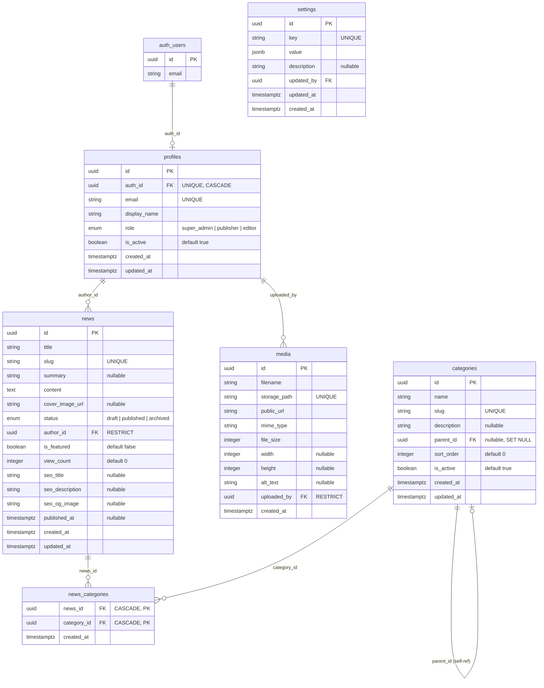

# Sprint 2.1 — 数据库实施设计文档

| 元数据       | 值                                                               |
| ------------ | ---------------------------------------------------------------- |
| **文档状态** | 待评审                                                           |
| **Sprint**   | 2.1 — 数据库实施阶段                                             |
| **作者**     | 技术负责人                                                       |
| **日期**     | 2026-06-05                                                       |
| **前置文档** | docs/PRD.md, docs/Architecture.md, docs/Database.md, ADR-001~005 |

---

## 目录

- [第一部分：数据库实施方案](#第一部分数据库实施方案)
- [第二部分：SQL 文件规划](#第二部分sql-文件规划)
- [第三部分：RLS 实施方案](#第三部分rls-实施方案)
- [第四部分：Storage 设计](#第四部分storage-设计)
- [第五部分：数据库 ER 图](#第五部分数据库-er-图)
- [第六部分：实施风险分析](#第六部分实施风险分析)

---

# 第一部分：数据库实施方案

## 1.1 表创建顺序与依赖关系

```
依赖链（→ 表示"依赖"）:

auth.users (Supabase 内置，已有)
  │
  ├──→ profiles          (FK → auth.users.id)
  │     ├──→ news        (FK → profiles.id)
  │     │     └──→ news_categories  (FK → news.id, categories.id)
  │     └──→ media       (FK → profiles.id)
  │
  ├──→ categories        (自引用 FK → categories.id)
  │     └──→ news_categories (同上)
  │
  └──→ settings          (无外部依赖)
```

### 创建顺序矩阵

| 序号 | 表                | 依赖的外部表           | 依赖的同级表 | 可并行  |
| ---- | ----------------- | ---------------------- | ------------ | ------- |
| 1    | `profiles`        | `auth.users`（已存在） | 无           | 第 1 批 |
| 2    | `categories`      | 无（自引用延迟添加）   | 无           | 第 1 批 |
| 3    | `settings`        | 无                     | 无           | 第 1 批 |
| 4    | `news`            | `profiles`             | 无           | 第 2 批 |
| 5    | `media`           | `profiles`             | 无           | 第 2 批 |
| 6    | `news_categories` | `news`, `categories`   | 无           | 第 3 批 |

**并行策略**：第 1 批（profiles + categories + settings）可在一个迁移文件中并行创建，因为他们无互相依赖。第 2 批（news + media）依赖 profiles，可在第 1 批完成后并行创建。第 3 批（news_categories）必须在前两批全部完成后创建。

## 1.2 外键约束策略

| 外键                          | 来源 → 目标                  | ON DELETE    | ON UPDATE | 说明                             |
| ----------------------------- | ---------------------------- | ------------ | --------- | -------------------------------- |
| `profiles.auth_id`            | profiles → auth.users        | **CASCADE**  | CASCADE   | 删除 auth 用户时自动清理 profile |
| `news.author_id`              | news → profiles              | **RESTRICT** | CASCADE   | 禁止删除尚有新闻的管理员         |
| `news_categories.news_id`     | news_categories → news       | **CASCADE**  | CASCADE   | 删除新闻时自动清理关联           |
| `news_categories.category_id` | news_categories → categories | **CASCADE**  | CASCADE   | 删除分类时自动清理关联           |
| `media.uploaded_by`           | media → profiles             | **RESTRICT** | CASCADE   | 禁止删除尚有媒体文件的管理员     |
| `categories.parent_id`        | categories → categories      | **SET NULL** | CASCADE   | 删除父分类时子分类提升为顶级     |

### 外键设计说明

1. **`profiles.auth_id → auth.users(id) ON DELETE CASCADE`**
   - Supabase Dashboard 中删除 auth 用户时自动清理 profiles
   - 反向不成立（删除 profile 不删除 auth 用户）

2. **`news.author_id → profiles(id) ON DELETE RESTRICT`**
   - 防止误删尚有新闻关联的管理员
   - 应用层应提示：删除前需先将新闻 reassign 给其他管理员

3. **`categories.parent_id → categories(id) ON DELETE SET NULL`**
   - 删除父分类时子分类自动变为顶级分类
   - 不级联删除，保护子分类数据

4. **`media.uploaded_by → profiles(id) ON DELETE RESTRICT`**
   - 防止误删尚有媒体文件的管理员

## 1.3 索引策略

### 3.1 主键索引（自动创建）

所有表使用 `uuid` 主键，PostgreSQL 自动创建 B-tree 主键索引。

### 3.2 唯一索引

| 表                | 列                       | 索引名                   | 目的             |
| ----------------- | ------------------------ | ------------------------ | ---------------- |
| `profiles`        | `auth_id`                | `profiles_auth_id_key`   | auth_id 唯一关联 |
| `profiles`        | `email`                  | `profiles_email_key`     | 邮箱唯一         |
| `categories`      | `slug`                   | `categories_slug_key`    | URL 路由         |
| `news`            | `slug`                   | `news_slug_key`          | URL 路由         |
| `news_categories` | `(news_id, category_id)` | `news_categories_pkey`   | 联合主键防重     |
| `media`           | `storage_path`           | `media_storage_path_key` | 防重复上传       |
| `settings`        | `key`                    | `settings_key_key`       | 配置键唯一       |

### 3.3 性能索引

| 表                | 列/表达式                                            | 索引名                        | 类型          | 场景             |
| ----------------- | ---------------------------------------------------- | ----------------------------- | ------------- | ---------------- |
| `profiles`        | `role`                                               | `idx_profiles_role`           | B-tree        | 按角色筛选管理员 |
| `profiles`        | `is_active`                                          | `idx_profiles_is_active`      | B-tree        | 筛选活跃/禁用    |
| `categories`      | `parent_id`                                          | `idx_categories_parent_id`    | B-tree        | 子分类查询       |
| `categories`      | `(is_active, sort_order)`                            | `idx_categories_active_sort`  | B-tree (复合) | 前台分类导航排序 |
| `news`            | `status`                                             | `idx_news_status`             | B-tree        | 按状态筛选       |
| `news`            | `published_at DESC`                                  | `idx_news_published_at`       | B-tree        | 时间线排序       |
| `news`            | `author_id`                                          | `idx_news_author_id`          | B-tree        | 按作者筛选       |
| `news`            | `(is_featured DESC, published_at DESC)`              | `idx_news_featured_published` | B-tree (复合) | 首页置顶+时间    |
| `news`            | `view_count DESC`                                    | `idx_news_view_count`         | B-tree        | 热门排序         |
| `news`            | `to_tsvector('simple', title \|\| ' ' \|\| content)` | `idx_news_fulltext`           | **GIN**       | 全文搜索         |
| `news_categories` | `news_id`                                            | `idx_nc_news_id`              | B-tree        | 查新闻的分类     |
| `news_categories` | `category_id`                                        | `idx_nc_category_id`          | B-tree        | 查分类的新闻     |
| `media`           | `uploaded_by`                                        | `idx_media_uploaded_by`       | B-tree        | 按上传者筛选     |
| `media`           | `created_at DESC`                                    | `idx_media_created_at`        | B-tree        | 图片库时间排序   |

### 3.4 索引注意事项

1. **GIN 索引策略**：`idx_news_fulltext` 使用 GIN 索引加速 `to_tsvector` 全文搜索。此索引在表创建时与表在同一迁移文件中建立，但**首次插入大量数据后建议 REINDEX**。
2. **复合索引顺序**：`idx_news_featured_published` 的列顺序为 `(is_featured DESC, published_at DESC)`，匹配首页查询的 `ORDER BY` 子句。
3. **避免过索引**：不在低选择性列（如 `status` 只有 3 个值）上建唯一索引；B-tree 仍可加速筛选。

## 1.4 事务策略

### 4.1 迁移事务

每个迁移文件使用 Supabase CLI 默认行为：**单个迁移文件整体作为一个事务**。单文件执行失败时整体回滚，不产生部分提交。

异常情况处理：

```
迁移 03_news.sql 执行成功
迁移 04_news_categories.sql 执行失败
→ 数据库状态：已创建 news 表，未创建 news_categories 表
→ 恢复：修复 04 迁移文件后重新执行 `supabase migration up`
→ 幂等性：非幂等操作（CREATE TABLE IF NOT EXISTS）不会报错
```

### 4.2 应用层事务

对于需要跨表一致性的操作（如创建新闻 + 关联分类），Supabase JS Client 不支持原生数据库事务。采用**补偿模式**：

```
操作：创建新闻 + 关联 3 个分类

1. INSERT INTO news          → 成功，返回 id
2. INSERT INTO news_categories (3 条) → 如果失败
   → 补偿：DELETE FROM news WHERE id = :刚刚创建的 id
   → 返回错误
```

**接受的不一致窗口**：步骤 1 成功但步骤 2 失败且补偿也失败时，存在孤立新闻记录（无分类）。影响：前台不显示（无分类不影响展示），后台"未分类"列表中可见。

**减轻措施**：在 Server Action 中，先写入 `news_categories` 再写入 `news`（倒序）。若 `news` 写入失败，`news_categories` 的记录虽被写入但因 FK 约束依赖 `news.id` 而失败（如果使用 generated id）——实际上 `news.id` 由 `gen_random_uuid()` 在应用层生成，可以先分配 UUID。更好的策略：

```
1. 应用层生成 news_id (uuid)
2. INSERT INTO news (id, ...)          → 使用预生成 id
3. INSERT INTO news_categories (批量)  → 使用同一 news_id
4. 若任一步失败，DELETE news WHERE id = :news_id 补偿
```

## 1.5 数据迁移顺序

```
Phase A: 基础设施
  01. extensions.sql        — 启用 pgcrypto 等扩展
  02. profiles.sql          — 管理员档案表（依赖 auth.users）

Phase B: 独立实体
  03. categories.sql        — 树形分类表（自引用 FK）
  07. settings.sql          — 系统配置表

Phase C: 依赖实体
  04. news.sql              — 新闻主表（依赖 profiles）
  06. media.sql             — 媒体表（依赖 profiles）

Phase D: 关联实体
  05. news_categories.sql   — 新闻分类关联表（依赖 news, categories）

Phase E: 完工
  08. indexes.sql           — 额外索引（GIN 等复杂索引独立管理）
  09. rls.sql               — 全部 RLS 策略
  10. storage.sql           — Storage bucket 配置
```

---

# 第二部分：SQL 文件规划

## 2.1 迁移文件清单

```
supabase/migrations/
│
├── 20260606000001_extensions.sql
├── 20260606000002_profiles.sql
├── 20260606000003_categories.sql
├── 20260606000004_news.sql
├── 20260606000005_news_categories.sql
├── 20260606000006_media.sql
├── 20260606000007_settings.sql
├── 20260606000008_indexes.sql
├── 20260606000009_rls.sql
└── 20260606000010_storage.sql
```

## 2.2 各文件职责

### `01_extensions.sql`

| 内容                                      | 说明                                  |
| ----------------------------------------- | ------------------------------------- |
| `CREATE EXTENSION IF NOT EXISTS pgcrypto` | 提供 `gen_random_uuid()` 函数         |
| `CREATE EXTENSION IF NOT EXISTS pg_trgm`  | 提供三元组模糊搜索（后续 ILIKE 优化） |

**不创建任何表**。纯扩展启用，幂等执行。

### `02_profiles.sql`

| 内容                                                  | 说明                                        |
| ----------------------------------------------------- | ------------------------------------------- |
| `CREATE TABLE public.profiles`                        | profiles 表结构                             |
| `profiles.auth_id → auth.users(id) ON DELETE CASCADE` | FK 约束                                     |
| `profiles.email` UNIQUE                               | 邮箱唯一                                    |
| `profiles.auth_id` UNIQUE                             | auth 关联唯一                               |
| `ALTER TABLE profiles ENABLE ROW LEVEL SECURITY`      | 启用 RLS（策略在 09 号文件）                |
| `role` CHECK 约束                                     | `IN ('super_admin', 'publisher', 'editor')` |

**注意**：此文件只创建表和约束，不创建 RLS 策略。

### `03_categories.sql`

| 内容                                                       | 说明         |
| ---------------------------------------------------------- | ------------ |
| `CREATE TABLE public.categories`                           | 分类表结构   |
| `categories.parent_id → categories(id) ON DELETE SET NULL` | 自引用 FK    |
| `categories.slug` UNIQUE                                   | URL 唯一标识 |
| `ALTER TABLE categories ENABLE ROW LEVEL SECURITY`         | 启用 RLS     |

**注意**：自引用 FK 在表创建后通过 ALTER TABLE ADD CONSTRAINT 添加，避免先有鸡还是先有蛋的问题。

### `04_news.sql`

| 内容                                               | 说明                                    |
| -------------------------------------------------- | --------------------------------------- |
| `CREATE TABLE public.news`                         | 新闻表结构（16 列）                     |
| `news.author_id → profiles(id) ON DELETE RESTRICT` | FK 约束                                 |
| `news.slug` UNIQUE                                 | URL 唯一标识                            |
| `status` CHECK 约束                                | `IN ('draft', 'published', 'archived')` |
| `ALTER TABLE news ENABLE ROW LEVEL SECURITY`       | 启用 RLS                                |
| `idx_news_fulltext` GIN 索引                       | 全文搜索                                |
| `idx_news_featured_published` 复合索引             | 排序优化                                |

**注意**：GIN 索引和复合索引在本文件中直接创建（而非统一放在 08 号文件），因为它们是 news 表的核心索引，与其他表无关。08 号文件只处理跨表或独立索引。

### `05_news_categories.sql`

| 内容                                                    | 说明               |
| ------------------------------------------------------- | ------------------ |
| `CREATE TABLE public.news_categories`                   | 关联表（联合主键） |
| `news_id → news(id) ON DELETE CASCADE`                  | FK                 |
| `category_id → categories(id) ON DELETE CASCADE`        | FK                 |
| `ALTER TABLE news_categories ENABLE ROW LEVEL SECURITY` | 启用 RLS           |

**注意**：此表无独立主键列，使用 `(news_id, category_id)` 联合主键。

### `06_media.sql`

| 内容                                            | 说明         |
| ----------------------------------------------- | ------------ |
| `CREATE TABLE public.media`                     | 媒体文件表   |
| `uploaded_by → profiles(id) ON DELETE RESTRICT` | FK           |
| `storage_path` UNIQUE                           | 存储路径唯一 |
| `ALTER TABLE media ENABLE ROW LEVEL SECURITY`   | 启用 RLS     |

**注意**：无 `updated_at` 列（媒体文件不可变设计）。

### `07_settings.sql`

| 内容                                             | 说明                    |
| ------------------------------------------------ | ----------------------- |
| `CREATE TABLE public.settings`                   | 系统配置表              |
| `key` UNIQUE NOT NULL                            | 配置键                  |
| `value` TEXT NOT NULL                            | 配置值（JSON 可序列化） |
| `ALTER TABLE settings ENABLE ROW LEVEL SECURITY` | 启用 RLS                |

**settings 表设计**（新增实体）：

```
列名       类型        约束                       说明
───        ────       ────                       ────
id         uuid       PK DEFAULT gen_random_uuid() 主键
key        text       UNIQUE NOT NULL              配置键
value      jsonb      NOT NULL DEFAULT '{}'         配置值（JSON）
description text      可空                          配置说明
updated_by uuid       FK → profiles(id)             最后修改者
updated_at timestamptz NOT NULL DEFAULT now()       修改时间
created_at timestamptz NOT NULL DEFAULT now()       创建时间
```

**预定义配置键**：

| key                    | value 示例       | 说明                         |
| ---------------------- | ---------------- | ---------------------------- |
| `site_name`            | `"NewsHub"`      | 站点名称                     |
| `site_description`     | `"新闻发布门户"` | 站点描述                     |
| `site_logo_url`        | `"https://..."`  | 站点 Logo                    |
| `seo_default_og_image` | `"https://..."`  | 默认 OG 图片                 |
| `news_per_page`        | `20`             | 每页新闻数                   |
| `max_featured_count`   | `5`              | 最大置顶新闻数（业务层限制） |

**RLS 策略**：仅超级管理员可读写 `settings` 表。前台通过 Server Action 读取公开配置（访客无需直接访问 settings 表）。

### `08_indexes.sql`

| 内容                         | 说明                              |
| ---------------------------- | --------------------------------- |
| `idx_profiles_role`          | profiles.role                     |
| `idx_profiles_is_active`     | profiles.is_active                |
| `idx_categories_parent_id`   | categories.parent_id              |
| `idx_categories_active_sort` | categories(is_active, sort_order) |
| `idx_news_status`            | news.status                       |
| `idx_news_published_at`      | news.published_at DESC            |
| `idx_news_author_id`         | news.author_id                    |
| `idx_news_view_count`        | news.view_count DESC              |
| `idx_nc_news_id`             | news_categories.news_id           |
| `idx_nc_category_id`         | news_categories.category_id       |
| `idx_media_uploaded_by`      | media.uploaded_by                 |
| `idx_media_created_at`       | media.created_at DESC             |

**注意**：04 号文件中已创建的 `idx_news_fulltext`（GIN）和 `idx_news_featured_published`（复合）不在此重复。`profiles_email_key`、`profiles_auth_id_key` 等 UNIQUE 约束自带索引，不在此重复。

### `09_rls.sql`

| 内容                               | 说明                  |
| ---------------------------------- | --------------------- |
| 所有表的 RLS 策略（CREATE POLICY） | 详见第三部分          |
| `update_updated_at_column()` 函数  | 触发器函数            |
| 各表的 BEFORE UPDATE 触发器        | 自动更新 `updated_at` |

**注意**：RLS 策略统一放在一个文件中管理，便于审查和维护。触发器函数也在此文件中创建。

### `10_storage.sql`

| 内容                          | 说明                                          |
| ----------------------------- | --------------------------------------------- |
| `INSERT INTO storage.buckets` | 创建 `news-covers` 和 `article-images` bucket |
| Storage RLS 策略              | 详见第四部分                                  |

**注意**：Storage bucket 的操作通过 Supabase SQL 或 Dashboard 均可完成。此文件使用 SQL 方式（通过 `storage` schema 操作），如果选择 Dashboard 手动创建则可省略此文件。

---

# 第三部分：RLS 实施方案

## 3.1 角色定义

参考 PRD.md 第 2.2 节：

| 角色       | profiles.role 值 | 说明               |
| ---------- | ---------------- | ------------------ |
| 访客       | 未登录（anon）   | 公网浏览           |
| 超级管理员 | `super_admin`    | 全部权限           |
| 发布者     | `publisher`      | 内容编辑+发布+置顶 |
| 编辑       | `editor`         | 仅内容编辑         |

## 3.2 全局权限矩阵

```
符号说明: ✓ = 允许  ✗ = 拒绝  △ = 有条件允许
```

### profiles 表

| 操作   | 访客 (anon) | 编辑 (editor) | 发布者 (publisher) | 超级管理员 (super_admin) |
| ------ | ----------- | ------------- | ------------------ | ------------------------ |
| SELECT | ✗           | △ 仅自身      | △ 仅自身           | ✓ 全部                   |
| INSERT | ✗           | ✗             | ✗                  | ✓                        |
| UPDATE | ✗           | ✗             | ✗                  | ✓                        |
| DELETE | ✗           | ✗             | ✗                  | ✗（软禁用）              |

**说明**：

- 访客完全不可见 profiles 表
- 普通管理员通过 `auth_id = auth.uid()` 策略只能看到自己的记录（用于 `requireRole` 查询角色）
- 超级管理员可看到全部 profiles
- DELETE 不允许（使用 `is_active = false` 软禁用）

### categories 表

| 操作   | 访客 (anon)         | 编辑 (editor) | 发布者 (publisher) | 超级管理员 (super_admin) |
| ------ | ------------------- | ------------- | ------------------ | ------------------------ |
| SELECT | ✓ 仅 is_active=true | ✓ 全部        | ✓ 全部             | ✓ 全部                   |
| INSERT | ✗                   | ✗             | ✗                  | ✓                        |
| UPDATE | ✗                   | ✗             | ✗                  | ✓                        |
| DELETE | ✗                   | ✗             | ✗                  | ✓（有新闻时拒绝）        |

**说明**：

- 访客仅能看到前台启用的分类
- 登录管理员能看到全部分类（包括禁用的）
- 仅超级管理员可管理分类（增删改）
- 删除分类通过 FK `ON DELETE SET NULL` 保护新闻数据

### news 表

| 操作   | 访客 (anon)    | 编辑 (editor)  | 发布者 (publisher) | 超级管理员 (super_admin) |
| ------ | -------------- | -------------- | ------------------ | ------------------------ |
| SELECT | ✓ 仅 published | ✓ 全部         | ✓ 全部             | ✓ 全部                   |
| INSERT | ✗              | ✓              | ✓                  | ✓                        |
| UPDATE | ✗              | △ 仅自己的草稿 | ✓ 全部草稿+已发布  | ✓ 全部                   |
| DELETE | ✗              | △ 仅自己的草稿 | ✗                  | ✓ 全部                   |

**UPDATE 条件细化**（编辑器）：

| 条件               | 编辑可更新 | 发布者可更新 | 超级管理员可更新 |
| ------------------ | ---------- | ------------ | ---------------- |
| 自己的草稿         | ✓          | ✓            | ✓                |
| 他人的草稿         | ✗          | ✓            | ✓                |
| 已发布（任意作者） | ✗          | ✓（下架）    | ✓                |
| `is_featured`      | ✗          | ✓            | ✓                |

### news_categories 表

| 操作   | 访客 (anon)        | 编辑 (editor)     | 发布者 (publisher) | 超级管理员 (super_admin) |
| ------ | ------------------ | ----------------- | ------------------ | ------------------------ |
| SELECT | ✓ 仅已发布新闻关联 | ✓ 全部            | ✓ 全部             | ✓ 全部                   |
| INSERT | ✗                  | ✓                 | ✓                  | ✓                        |
| DELETE | ✗                  | ✓（CASCADE 联动） | ✓（CASCADE 联动）  | ✓                        |

**说明**：

- 访客只能看到已发布新闻的分类关联（与 news SELECT 策略联动）
- INSERT/DELETE 权限与 news 表对应操作权限一致
- 编辑通过 news_categories 的 INSERT 和 DELETE 来管理自己稿件的分类关联
- `ON DELETE CASCADE` 确保删除新闻时自动清理关联

### media 表

| 操作   | 访客 (anon)                | 编辑 (editor)  | 发布者 (publisher) | 超级管理员 (super_admin) |
| ------ | -------------------------- | -------------- | ------------------ | ------------------------ |
| SELECT | ✗（通过 CDN/URL 访问文件） | ✓ 全部         | ✓ 全部             | ✓ 全部                   |
| INSERT | ✗                          | ✓              | ✓                  | ✓                        |
| UPDATE | ✗                          | △ 仅自己的文件 | △ 仅自己的文件     | ✓ 全部                   |
| DELETE | ✗                          | △ 仅自己的文件 | △ 仅自己的文件     | ✓ 全部                   |

**说明**：

- 访客不通过数据库查询 media 表（图片 URL 直接从 news 表的 `cover_image_url` 获取）
- 媒体文件本身通过 Storage 公开读访问（见第四部分）
- 管理员删除媒体：仅自己的文件 + 超级管理员可删除全部

### settings 表

| 操作   | 访客 (anon) | 编辑 (editor) | 发布者 (publisher) | 超级管理员 (super_admin) |
| ------ | ----------- | ------------- | ------------------ | ------------------------ |
| SELECT | ✗           | ✓             | ✓                  | ✓                        |
| INSERT | ✗           | ✗             | ✗                  | ✓                        |
| UPDATE | ✗           | ✗             | ✗                  | ✓                        |
| DELETE | ✗           | ✗             | ✗                  | ✗（通过 UPDATE 管理）    |

**说明**：

- settings 表不直接暴露给访客，前台通过 Server Action 获取公开配置
- 登录管理员可读取配置（用于后台显示）
- 仅超级管理员可以修改配置
- 删除不允许，配置通过 KEY 唯一约束保证不会重复

## 3.3 RLS 策略风险清单

| 风险               | 场景                                               | 缓解                                                                                           |
| ------------------ | -------------------------------------------------- | ---------------------------------------------------------------------------------------------- |
| RLS 策略冲突       | 多个策略同时匹配同一操作                           | PostgreSQL 对同一操作允许多个 USING 策略，OR 逻辑组合——确保策略不互相矛盾                      |
| RLS 被 BYPASS      | 使用 service_role key 查询                         | service_role key 仅限 Server Action 使用，不暴露给客户端                                       |
| RLS 性能衰减       | 策略中使用子查询(EXISTS SELECT)                    | 子查询中使用索引（`profiles.auth_id` 有唯一索引，性能可接受）                                  |
| RLS 误配置导致泄露 | 超级管理员策略使用 `auth.role() = 'authenticated'` | 精确使用 `EXISTS (SELECT 1 FROM profiles WHERE auth_id = auth.uid() AND role = 'super_admin')` |

---

# 第四部分：Storage 设计

## 4.1 Bucket 配置

根据 PRD 图片上传需求和 Architecture.md 存储设计，划分为两个独立 Bucket：

### Bucket A: `news-covers`

| 属性         | 值                                      |
| ------------ | --------------------------------------- |
| 用途         | 新闻封面图、OG 图片、列表缩略图         |
| 公开访问     | 是（访客需要查看）                      |
| 文件大小上限 | 5MB                                     |
| 推荐尺寸     | 1200×630px（OG 标准）                   |
| 允许类型     | `image/jpeg`, `image/png`, `image/webp` |

### Bucket B: `article-images`

| 属性         | 值                                                   |
| ------------ | ---------------------------------------------------- |
| 用途         | 富文本编辑器正文中插入的图片                         |
| 公开访问     | 是（访客需要查看）                                   |
| 文件大小上限 | 5MB                                                  |
| 推荐尺寸     | 宽度 ≤ 800px                                         |
| 允许类型     | `image/jpeg`, `image/png`, `image/webp`, `image/gif` |

### 为什么拆分为两个 Bucket？

| 维度     | 单一 Bucket        | 双 Bucket（选中）                                |
| -------- | ------------------ | ------------------------------------------------ |
| 管理粒度 | 粗                 | 可分别为封面和正文设置不同策略                   |
| 路径组织 | 需在路径中区分类型 | 天然分离，`news-covers` vs `article-images`      |
| 未来扩展 | 迁移困难           | 可独立扩展（如为封面增加 CDN 预热）              |
| 清理策略 | 混淆               | 可分别处理（封面图更谨慎保留，正文图可按需清理） |

## 4.2 上传权限

| 角色                     | news-covers | article-images |
| ------------------------ | ----------- | -------------- |
| 访客 (anon)              | ✗           | ✗              |
| 编辑 (editor)            | ✓           | ✓              |
| 发布者 (publisher)       | ✓           | ✓              |
| 超级管理员 (super_admin) | ✓           | ✓              |

**实现方式**：Storage RLS 策略，检查 `auth.role() = 'authenticated'` + 在 `profiles` 表中存在对应记录。

## 4.3 访问权限

| 访问者      | news-covers | article-images |
| ----------- | ----------- | -------------- |
| 访客 (匿名) | ✓ 公开读    | ✓ 公开读       |
| 登录管理员  | ✓ 公开读    | ✓ 公开读       |

**实现方式**：Bucket 设置为 `public = true`（公开桶）。或通过 Storage RLS 设置公开 SELECT 策略。

**为什么使用公开桶而非私有桶 + 签名 URL**：

- 新闻内容中的图片需要被搜索引擎索引（SEO）
- OG 图片需要被社交平台抓取（Open Graph）
- 签名 URL 会增加图片加载延迟
- 非敏感内容，公开是合理选择

## 4.4 文件命名规则

### 路径模板

```
{Bucket} / {year}{month} / {profile_id} / {timestamp} - {sanitized_filename}
```

### 示例

```
news-covers/202606/a1b2c3d4/20260605143000-breaking-news-cover.webp
article-images/202606/a1b2c3d4/20260605143122-chart-analysis.png
```

### path 段说明

| 段                     | 取值方式                                     | 说明                       |
| ---------------------- | -------------------------------------------- | -------------------------- |
| `{Bucket}`             | 固定值 `news-covers` 或 `article-images`     | 区分类型                   |
| `{year}{month}`        | 服务器时间 `202606`                          | 按时间分区，避免单目录超限 |
| `{profile_id}`         | `profiles.id`（UUID 前 8 字符）              | 按上传者分区，便于审计     |
| `{timestamp}`          | `YYYYMMDDHHmmss`                             | 确保唯一性                 |
| `{sanitized_filename}` | 原始文件名：去特殊字符、转小写、截断 50 字符 | 保留可读性                 |

### 文件名 sanitize 规则

```
输入: "Breaking News! (封面图).png"
输出: "breaking-news-封面图.png"
规则: 去除特殊字符、转小写、中文保留、空格转连字符、截断50字符+扩展名
```

## 4.5 上传流程（概要）

```
1. 管理员选择文件
2. 客户端：校验文件类型 + 大小（快速反馈）
3. Server Action: uploadMedia(file, bucket, alt_text?)
   a. 权限检查（requireRole('editor', 'publisher', 'super_admin'))
   b. 服务端 MIME 类型校验（image/jpeg, image/png, image/webp, image/gif）
   c. 服务端文件大小校验（≤ 5MB）
   d. 生成存储路径
   e. supabase.storage.from(bucket).upload(path, file, { upsert: false })
   f. INSERT INTO media (filename, storage_path, public_url, mime_type, file_size, ...)
   g. 返回 media 记录（含 public_url）
4. 图片库更新
```

---

# 第五部分：数据库 ER 图

## 5.1 完整 ER 图（Mermaid）



## 5.2 关系说明

| 关系                           | 类型                       | 说明                               |
| ------------------------------ | -------------------------- | ---------------------------------- |
| `auth.users → profiles`        | 1:1                        | 一个 auth 用户对应一个 profile     |
| `profiles → news`              | 1:N                        | 一个管理员可创建多篇新闻           |
| `profiles → media`             | 1:N                        | 一个管理员可上传多个媒体文件       |
| `categories → categories`      | 1:N (自引用)               | 树形分类，一个父分类可有多个子分类 |
| `news → news_categories`       | 1:N                        | 一条新闻可关联多个分类             |
| `categories → news_categories` | 1:N                        | 一个分类可被多条新闻关联           |
| `news : categories`            | N:M (通过 news_categories) | 多对多关系                         |
| `profiles → settings`          | 1:N                        | 一个管理员可修改多条配置           |

---

# 第六部分：实施风险分析

## 6.1 RLS 风险

### 风险 1：策略配置遗漏

| 属性     | 描述                                                                                                                                        |
| -------- | ------------------------------------------------------------------------------------------------------------------------------------------- |
| **风险** | 新建表后忘记启用 RLS（`ALTER TABLE ... ENABLE ROW LEVEL SECURITY`），导致所有操作默认开放                                                   |
| **概率** | 低                                                                                                                                          |
| **影响** | 严重：未认证用户可以任意操作数据                                                                                                            |
| **缓解** | 每个迁移文件中在 CREATE TABLE 后立即执行 `ALTER TABLE ... ENABLE ROW LEVEL SECURITY`，在同一个迁移中完成。迁移前的 checklist 中增加此项检查 |

### 风险 2：策略逻辑覆盖不完整

| 属性     | 描述                                                                                                                                                                 |
| -------- | -------------------------------------------------------------------------------------------------------------------------------------------------------------------- |
| **风险** | UPDATE 策略未涵盖所有场景（如 editor 更新他人的已发布新闻）                                                                                                          |
| **概率** | 中                                                                                                                                                                   |
| **影响** | 中等：授权不当                                                                                                                                                       |
| **缓解** | 所有策略按角色分拆编写（如 `policy_news_update_editor`, `policy_news_update_publisher`, `policy_news_update_super`），每个策略职责单一。代码审查时逐策略核对权限矩阵 |

### 风险 3：service_role key 泄露

| 属性     | 描述                                                                                                                                     |
| -------- | ---------------------------------------------------------------------------------------------------------------------------------------- |
| **风险** | SUPABASE_SERVICE_ROLE_KEY 在客户端代码中暴露，导致绕过所有 RLS                                                                           |
| **概率** | 低                                                                                                                                       |
| **影响** | 灾难性                                                                                                                                   |
| **缓解** | 此 key 仅在 Server Actions 和 Supabase Migration 中使用。通过 ESLint 规则禁止 `process.env.SUPABASE_SERVICE_ROLE_KEY` 在客户端组件中出现 |

## 6.2 分类树风险

### 风险 4：循环引用

| 属性     | 描述                                                                                                                                                             |
| -------- | ---------------------------------------------------------------------------------------------------------------------------------------------------------------- |
| **风险** | 更新分类 `parent_id` 时形成循环（A→B→C→A），导致递归查询死循环                                                                                                   |
| **概率** | 中                                                                                                                                                               |
| **影响** | 中等：递归 CTE 无限循环                                                                                                                                          |
| **缓解** | 应用层在更新 `parent_id` 前验证：新 `parent_id` 不能是当前分类本身或其任意子分类。第一版不做递归 CTE，分类树的展示通过前端递归构建（读取全部分类后在内存中组树） |

### 风险 5：层级过深

| 属性     | 描述                                                               |
| -------- | ------------------------------------------------------------------ |
| **风险** | 分类嵌套过多层，前端展示困难                                       |
| **概率** | 低                                                                 |
| **影响** | 低：前端展示问题                                                   |
| **缓解** | 业务层限制 ≤ 3 层。Server Action 中在创建/更新分类时校验祖先链深度 |

### 风险 6：删除有子分类的父分类

| 属性     | 描述                                                                                 |
| -------- | ------------------------------------------------------------------------------------ |
| **风险** | 删除父分类时，子分类 `parent_id` 被 SET NULL，丢失层级关系                           |
| **概率** | 中                                                                                   |
| **影响** | 低：子分类变为顶级，非数据丢失                                                       |
| **缓解** | 这是设计意图（`ON DELETE SET NULL`）。前端在删除前提示用户关联的子分类将变为顶级分类 |

## 6.3 数据一致性风险

### 风险 7：profiles 与 auth.users 不一致

| 属性     | 描述                                                                                                                                                                                   |
| -------- | -------------------------------------------------------------------------------------------------------------------------------------------------------------------------------------- |
| **风险** | 存在 auth 用户但无 profile 记录（创建流程中断），或有 profile 记录但 auth 用户已删除                                                                                                   |
| **概率** | 低                                                                                                                                                                                     |
| **影响** | 中等：管理员无法登录或出现幽灵记录                                                                                                                                                     |
| **缓解** | 创建流程：先 `auth.admin.createUser()`，成功后立即创建 profile。失败时回滚已创建的 auth 用户。启动时或定时任务可运行一致性检查脚本。前端 `requireRole` 函数中处理 profile 不存在的情况 |

### 风险 8：news 与 news_categories 不一致

| 属性     | 描述                                                                                                          |
| -------- | ------------------------------------------------------------------------------------------------------------- |
| **风险** | 更新分类关联时应用层事务中断，导致孤立关联或缺失关联                                                          |
| **概率** | 中（网络中断、Serverless 超时）                                                                               |
| **影响** | 低：新闻显示为"未分类"或显示错误的分类                                                                        |
| **缓解** | 先删后插模式（`DELETE` + `INSERT`），出现不一致时最多丢失分类关联（新闻本身不受影响）。后续可通过定时任务修复 |

### 风险 9：view_count 精度损失

| 属性     | 描述                                                                           |
| -------- | ------------------------------------------------------------------------------ |
| **风险** | 进程重启时内存中未 flush 的浏览计数丢失                                        |
| **概率** | 中（Vercel 冷启动时）                                                          |
| **影响** | 低：少量计数损失，在 ADR-003 的容忍范围内（≤ 5 分钟）                          |
| **缓解** | flush 间隔 ≤ 60 秒；在 shutdown 钩子中执行强制 flush。PRD 已明确允许计数不精确 |

## 6.4 性能风险

### 风险 10：GIN 全文搜索索引写入性能

| 属性     | 描述                                                                                                                               |
| -------- | ---------------------------------------------------------------------------------------------------------------------------------- |
| **风险** | GIN 索引在大量并发 INSERT/UPDATE 时写入性能下降                                                                                    |
| **概率** | 低（第一版数据量小）                                                                                                               |
| **影响** | 中                                                                                                                                 |
| **缓解** | 第一版使用 ILIKE 作为主要搜索方式（不走 GIN 索引），GIN 索引作为后续优化保留。发布新闻时 bulk insert/update 不频繁，性能影响可接受 |

### 风险 11：分类页 JOIN 查询性能

| 属性     | 描述                                                                                                                                                                                           |
| -------- | ---------------------------------------------------------------------------------------------------------------------------------------------------------------------------------------------- |
| **风险** | `news JOIN news_categories` 分页查询在数据量大时性能下降                                                                                                                                       |
| **概率** | 低（万级新闻量）                                                                                                                                                                               |
| **影响** | 中                                                                                                                                                                                             |
| **缓解** | `idx_nc_category_id` 索引确保 `WHERE nc.category_id = :id` 走 Index Scan。`news` 的 `published_at` 索引确保排序走 Index Scan Backward。预估在 10 万条新闻 + 10 个分类下，JOIN 查询在 50ms 以内 |

### 风险 12：ISR + RLS 缓存不一致

| 属性     | 描述                                                                                                                |
| -------- | ------------------------------------------------------------------------------------------------------------------- |
| **风险** | ISR 缓存的页面展示了已下架的新闻（因为 ISR revalidate 间隔）                                                        |
| **概率** | 中                                                                                                                  |
| **影响** | 低：最多 60s 的不一致窗口                                                                                           |
| **缓解** | ISR revalidate 设为 60s。发布/下架操作时调用 `revalidatePath()` 立即清除缓存。这是 Next.js 的已知行为，非数据库问题 |

## 6.5 风险矩阵汇总

| #   | 风险                   | 概率 | 影响   | 优先级 | 缓解责任人            |
| --- | ---------------------- | ---- | ------ | ------ | --------------------- |
| 1   | RLS 配置遗漏           | 低   | 严重   | **高** | 迁移代码审查          |
| 2   | RLS 策略不完整         | 中   | 中等   | 中     | 逐策略核对矩阵        |
| 3   | service_role key 泄露  | 低   | 灾难性 | **高** | ESLint 规则           |
| 4   | 分类循环引用           | 中   | 中等   | 中     | 应用层验证            |
| 5   | 分类层级过深           | 低   | 低     | 低     | 业务层限制            |
| 6   | 父分类删除             | 中   | 低     | 低     | 前端提示（设计预期）  |
| 7   | profiles/auth 不一致   | 低   | 中等   | 中     | 创建流程 + 启动检查   |
| 8   | news_categories 不一致 | 中   | 低     | 低     | 先删后插 + 容忍策略   |
| 9   | view_count 丢失        | 中   | 低     | 低     | flush 策略（ADR-003） |
| 10  | GIN 索引性能           | 低   | 中     | 低     | ILIKE 兜底            |
| 11  | 分类 JOIN 性能         | 低   | 中     | 低     | 索引覆盖              |
| 12  | ISR 缓存不一致         | 中   | 低     | 低     | revalidatePath        |

---

## 附录：术语表

| 术语     | 说明                                            |
| -------- | ----------------------------------------------- |
| RLS      | Row Level Security，行级安全策略                |
| FK       | Foreign Key，外键                               |
| GIN      | Generalized Inverted Index，通用倒排索引        |
| ISR      | Incremental Static Regeneration，增量静态再生成 |
| CASCADE  | 级联操作，删除父记录时自动处理子记录            |
| RESTRICT | 限制操作，存在关联记录时禁止删除                |
| SET NULL | 删除父记录时将外键置空                          |
| CTE      | Common Table Expression，通用表表达式           |
